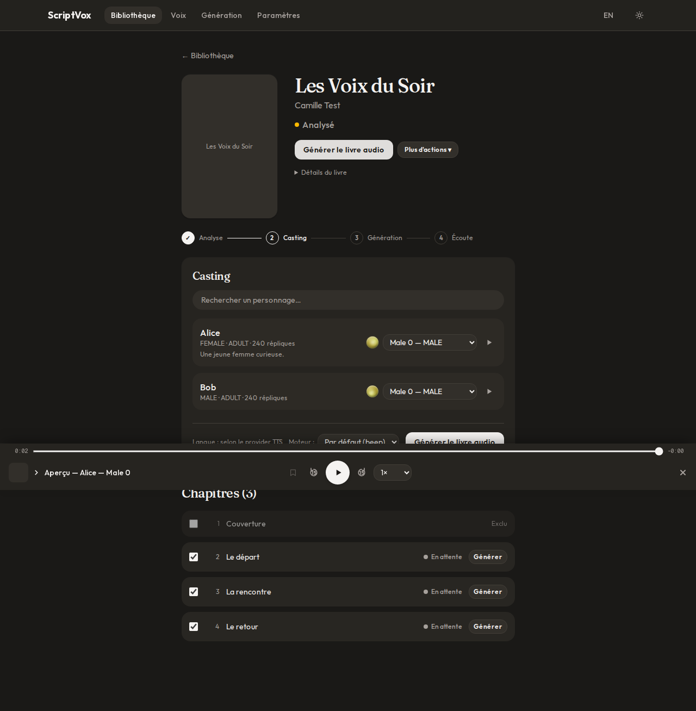
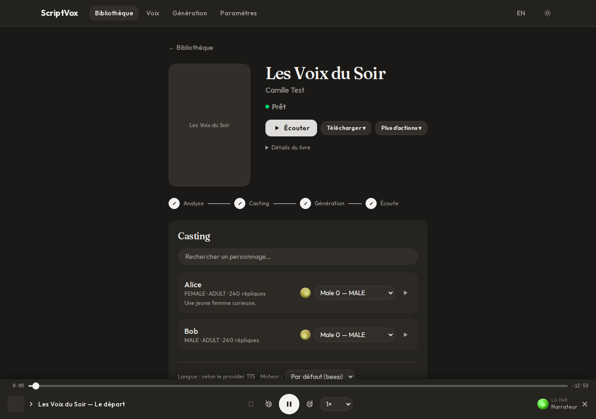
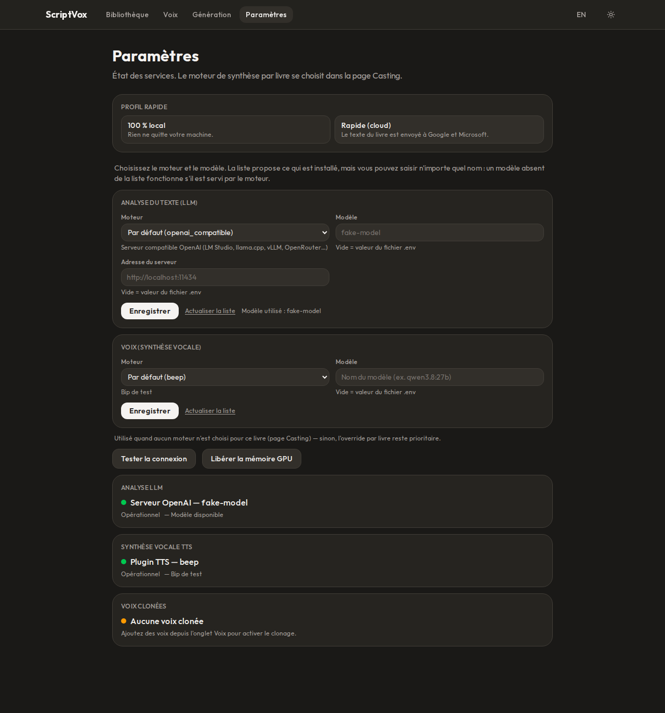
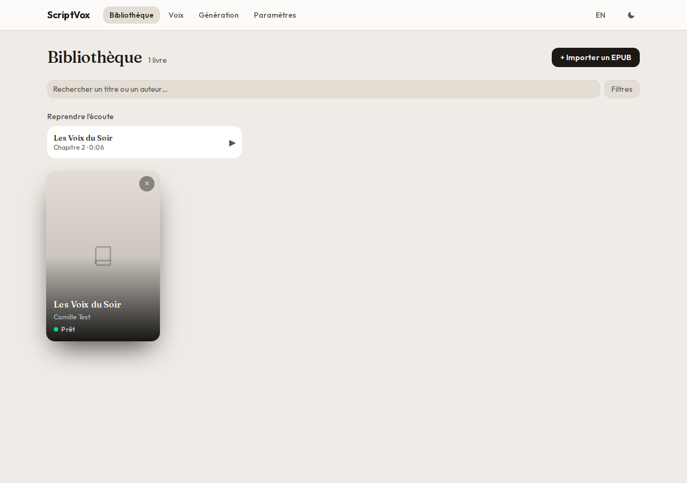

# ScriptVox

Turn an EPUB into a **multi-voice audiobook**: a language model reads the book, finds the characters
and who says each line, every character gets its own voice, and the result is exported as a
**chaptered M4B** (plus MP3) with the cover.

- **Any model, any engine** — pick the model in *Settings* (a list of what is installed, but any name
  is accepted), plug an OpenAI-compatible server, an external program, or drop a Python **plugin**
  for an engine the project has never heard of. → [Changing models](#changing-models-and-engines)
- **Runs locally or in the cloud** — Ollama / LM Studio / llama.cpp + Qwen3-TTS or Piper on your own
  machine, or Gemini + EdgeTTS with zero setup. Nothing has to leave your computer if you don't want it to.
- **Emotion per line**, **voice cloning**, casting screen with per-character voice preview, chapter
  by chapter regeneration, resume after a crash.

| Book page: progress with time left, casting | Finished book: player that resumes where you stopped |
|---|---|
|  |  |

| Settings: any engine, any model name | Library (light theme) |
|---|---|
|  |  |

> ⚠️ **Local, single-user tool — no authentication.** It is built to run on `localhost` for yourself.
> **Do not expose it to the internet** (see [Security](#security)).
>
> **Privacy.** With `LLM_PROVIDER=gemini` and/or `TTS_PROVIDER=edgetts` your book's text is sent to
> Google / Microsoft (on Gemini's free tier, Google may use it to improve its products — check the
> current terms). For a fully local run use Ollama (or any local server) + Qwen3-TTS / Piper.

---

## Quick start

```bash
./setup.sh      # first time only: venv, backend + frontend deps, frontend build, .env files
./start.sh      # API + worker + frontend (production build; ./start.sh --dev for hot reload)
```

Windows: `setup.ps1` / `start.ps1` (`-Dev` for hot reload); `start.bat` also works after `setup.ps1`.

Then open <http://localhost:3000> (API docs: <http://localhost:8000/docs>).

Pick **one** LLM path in `.env` (created by `setup.sh`, default Ollama) — or later in *Settings*:

| Path | How |
|---|---|
| **Fastest** | `LLM_PROVIDER=gemini` + `GEMINI_API_KEY` ([get one](https://aistudio.google.com/apikey)) |
| **Fully local** | keep `LLM_PROVIDER=ollama`, install [Ollama](https://ollama.com/download), `ollama pull <model>` |
| **Any local server** | `LLM_PROVIDER=openai_compatible` + `OPENAI_BASE_URL` / `OPENAI_MODEL` (LM Studio, llama.cpp `llama-server`, vLLM…) |

Not sure what's missing? `python scripts/doctor.py` checks Python, Node, ffmpeg, providers, and the
GPU, and prints the exact command to fix each problem. It never installs anything.

**Requirements:** Python **3.11 – 3.13** (3.12 recommended — 3.14 is not supported yet), Node 20+,
and optionally [ffmpeg](https://ffmpeg.org/download.html) for the chaptered M4B export (without it you
still get the MP3).

### Which setup for which machine?

| Machine | LLM | TTS |
|---|---|---|
| Any laptop, no GPU | `gemini` (cloud) | `edgetts` (cloud) — default |
| Any laptop, offline | `ollama` small model (e.g. `qwen3:1.7b`) | `piper` |
| GPU with 12–16 GB | `ollama` / `openai_compatible` with a 14–30 B model (quantised) | `qwen` (needs PyTorch for your GPU) |
| AMD Radeon | as above — see [AMD GPUs](#amd-gpus-rocm) | `qwen` with PyTorch **ROCm** |

A 16 GB card cannot hold a large LLM and a TTS model at the same time; ScriptVox unloads the LLM
after the analysis (`LLM_UNLOAD_AFTER_ANALYSIS`) and keeps the TTS model loaded for the whole book.

---

## Changing models and engines

Everything below works **without touching the code**.

1. **Settings page** — choose the engine and type/pick the model for both the *analysis LLM* and the
   *voices*. The dropdown lists what the engine reports (installed Ollama models, models served by an
   OpenAI-compatible server, Qwen presets…), but **any name is accepted**: a model that is not in
   the list works if the engine serves it. Values saved here take priority over `.env`.
   One-click profiles: *100 % local* / *Fast (cloud)*.
2. **Official engines**

   | Kind | Names |
   |---|---|
   | LLM | `ollama`, `gemini`, `openai_compatible` |
   | TTS | `edgetts`, `piper`, `qwen`, `openai_tts`, `command` |

3. **Generic engines** for models the project has no code for:
   - `openai_compatible` (LLM) — any server speaking the OpenAI Chat API.
   - `openai_tts` — any server exposing `POST /v1/audio/speech`, with a voice table, extra body fields
     and an emotion field, all in `.env`.
   - `command` — any external program (`TTS_COMMAND=python my_tts.py {text_file} {out} {voice}`);
     no shell is used, so the book's text can never inject commands. Set in `.env` only.
   - `qwen` accepts **any** Hugging Face id or local path of a compatible checkpoint as `QWEN_MODEL`.
4. **Plugins** — drop `my_engine.py` in `plugins/tts/` or `plugins/llm/` (templates provided):
   the engine appears in *Settings* on the next restart. → **[docs/PLUGINS.md](docs/PLUGINS.md)**

Any audio format works: an engine may return WAV, MP3, FLAC or OGG at any sample rate — everything is
converted to 24 kHz mono internally.

### Which models are good? (as of September 2026 — measure, don't trust)

- **LLM.** The task is French dialogue attribution, which public benchmarks don't measure. Use
  `python scripts/bench_llm.py` on *your* books to compare models (attribution rate, time, VRAM).
  Candidates: a Qwen 3.x dense/MoE model that fits your VRAM (quantised), or `gemini-3.1-flash-lite`
  for the cloud path. `gemini-2.0-flash` is **retired** (June 2026); `gemini-2.5-flash` stops on
  2026-10-16.
- **TTS.** Judge by ear: `python scripts/bench_tts.py --provider <engine>` renders the same French
  script with any engine so you can compare. Notes on the open models currently around: Qwen3-TTS
  (Apache 2.0, cloning, weak emotion), Chatterbox Multilingual (MIT, emotion slider, cloning),
  Fish Audio S2 Pro and Higgs Audio v3 (strong emotion tags, **non-commercial** licences),
  Voxtral TTS (CC BY-NC, no cloning in the open weights). Add any of them as a plugin.

---

## Qwen3-TTS (local GPU)

Emotion per line (`instruct`), voice cloning, 24 kHz output. The speaker → gender mapping and the
French quality were checked by ear on 2026-06-27 (some presets carry a slight accent; the `instruct`
emotion effect is subtle — cloning is often the better way to differentiate characters).

```bash
# 1. PyTorch matching YOUR GPU (see requirements-qwen.txt for NVIDIA and AMD)
# 2.
pip install -r requirements-qwen.txt
# 3. .env: TTS_PROVIDER=qwen   (or choose it in Settings)
```

~4–6 GB VRAM, ~4.5 GB download on first use. The model stays loaded from one chapter to the next and
is unloaded after `TTS_IDLE_UNLOAD_SECONDS` of inactivity (or from *Settings → Free GPU memory*).

**Voice cloning:** *Voices → New cloned voice*, a 3–15 s clean sample. Also paste the **transcript** of
the sample: with it, cloning reproduces the speaking style too, without it only the timbre.

### AMD GPUs (ROCm)

A **CUDA** build of PyTorch cannot use an AMD card (it falls back to the CPU, or fails). Install PyTorch
for **ROCm** following AMD's official instructions for Radeon
([rocm.docs.amd.com/projects/radeon-ryzen](https://rocm.docs.amd.com/projects/radeon-ryzen/)) — the RX 9000
series (RDNA 4) is supported by ROCm 7.x. Keep `QWEN_DEVICE=cuda:0` (ROCm exposes the `torch.cuda` API)
and `QWEN_ATTN=sdpa`. Check with `python scripts/doctor.py`. If the driver resets during generation
on an RX 9000, set `TORCH_BLAS_PREFER_HIPBLASLT=0`.

For **Ollama** on an RX 9000 on Windows, the stock installer may ship a ROCm build too old for RDNA 4:
either use an Ollama build with ROCm 7 or its Vulkan backend, or serve the model with LM Studio /
`llama-server` (Vulkan) and use `LLM_PROVIDER=openai_compatible`.

---

## Piper (local, CPU)

Piper is invoked as a standalone executable (not the `piper-tts` pip package, which has no Windows wheel).

1. Download the archive for your platform from [github.com/rhasspy/piper/releases](https://github.com/rhasspy/piper/releases)
   and extract it (keep `espeak-ng-data/` and the `.dll` files next to the binary).
2. Set `PIPER_BINARY_PATH` (e.g. `./piper/piper/piper.exe`) and `PIPER_VOICES_DIR` (default `./voices`).
3. Put in `PIPER_VOICES_DIR` one `<voice_id>.onnx` **and** one `<voice_id>.onnx.json` per logical voice:
   `narrator`, `male_0`–`male_2`, `female_0`–`female_2`, `neutral_0`–`neutral_1`
   (voices: [huggingface.co/rhasspy/piper-voices](https://huggingface.co/rhasspy/piper-voices); a missing or
   misnamed `.onnx.json` makes Piper crash with an empty error).

Piper is GPL-3.0: any distribution bundling the binary must comply with it.

---

## Output

Each finished book gives:

- **`.m4b`** — AAC audiobook with **chapter markers and cover** (needs ffmpeg). This is the format
  audiobook apps expect (Apple Books, BookPlayer, VLC…). Download it from the book page.
- **`.mp3`** and **`.wav`** — the same audio, plain.

Audio details: 24 kHz mono; a short silence after each line (longer when the voice changes) and between
chapters (`AUDIO_PAUSE_*`); loudness evened out across voices (`AUDIO_NORMALIZE`); long passages are
split at sentence ends before synthesis.

The in-app player resumes where you stopped, chains chapters, supports a sleep timer, media keys /
lock-screen controls and keyboard shortcuts (`Space`, `←`/`→` = −15 s/+30 s, `[` `]` = speed).

---

## Configuration

Copy `.env.example` to `.env` (done by `setup.sh`). It is fully commented; the essentials:

| Variable | Description |
|---|---|
| `LLM_PROVIDER` | `ollama` · `gemini` · `openai_compatible` · a plugin name |
| `TTS_PROVIDER` | `edgetts` · `piper` · `qwen` · `openai_tts` · `command` · a plugin name |
| `OLLAMA_*`, `GEMINI_*`, `OPENAI_*` | engine address / model / key |
| `EDGETTS_LOCALE` | default voice language (`fr-FR`); a book's own language wins |
| `QWEN_MODEL`, `QWEN_DEVICE`, `QWEN_ATTN` | Qwen3-TTS model (`1.7b`, `0.6b` or any checkpoint), device, attention |
| `AUDIO_*`, `TTS_*` | pauses, loudness, splitting, concurrency, idle unload |
| `PLUGINS_DIR` | folder scanned for your engines |
| `DATA_DIR`, `DATABASE_URL`, `HUEY_DB_PATH` | storage |
| `FRONTEND_ORIGINS`, `ALLOWED_HOSTS` | browser origins allowed to write, accepted `Host` names |

The app **fails at startup** if a variable required by the active provider is missing. Providers other
than the default validate their prerequisites lazily, with a clear error at first use.

**Database migrations** run automatically at startup (Alembic; a pre-Alembic database is stamped at the
baseline, then upgraded). After changing a `SQLModel` model, generate the migration by hand:
`alembic revision --autogenerate -m "short description"` and review it before committing.

---

## Security

Designed for one user on one machine:

- **Bind to localhost.** `start.*` bind the API and the frontend to `127.0.0.1`.
- **Cross-site writes are refused** (a page open in your browser cannot post to your local API: any
  write must come from `FRONTEND_ORIGINS`), and unknown `Host` headers are rejected (DNS-rebinding
  defence, `ALLOWED_HOSTS`).
- **EPUB uploads** are capped at 200 MB and checked against decompression bombs (uncompressed size,
  file count, compression ratio).
- **The external-command engine can only be configured in `.env`**, never through the web interface;
  no shell is ever involved.
- **Plugins run with your rights** — install only code you trust.
- To reach the app from another device (e.g. over a VPN), put an authenticating reverse proxy in
  front of it; never bind the API to `0.0.0.0` on an untrusted network.

Report vulnerabilities as described in [SECURITY.md](SECURITY.md).

---

## Tests

Each phase has its own standalone suite (`tests/check_phaseN.py`), all mocking external services and
running offline. Run everything:

```bash
python tests/run_all.py          # every suite, in numeric order, one subprocess each
python tests/run_all.py 45 46    # only some suites
```

CI (GitHub Actions) runs them on Python 3.11 / 3.12 / 3.13, plus lint and a production build of the
frontend. See `TASKS.md` for the roadmap and `CHANGELOG.md` for what shipped.

---

## Troubleshooting

| Symptom | Cause / fix |
|---|---|
| `pip install` fails building `pydantic-core` (Rust) | Python 3.14: use 3.11 – 3.13 |
| Qwen is very slow / `torch.cuda.is_available()` is `False` | wrong PyTorch build for your GPU — `python scripts/doctor.py` |
| `ollama ps` shows `31% CPU` | model too big for the VRAM: smaller/quantised model, lower `OLLAMA_CONTEXT_TOKENS` |
| Piper "crashes with an empty error" | `<voice>.onnx.json` missing or misnamed |
| No `.m4b` | ffmpeg not on PATH (set `FFMPEG_PATH`); the MP3 is still there |
| Web app shows "API unreachable" | API not running, or a different `NEXT_PUBLIC_API_URL` |
| `403 Cross-origin write refused` | you reach the frontend through an origin missing from `FRONTEND_ORIGINS` |
| `400 Invalid host header` | reaching the API through a hostname missing from `ALLOWED_HOSTS` |
| `database is locked` | should not happen (SQLite runs in WAL mode); restart API + worker |

---

## Architecture

See [ARCHITECTURE.md](ARCHITECTURE.md) for the design reference (label-based LLM protocol, engine
registry, token budgeting, job state machine, storage layout) and [docs/PLUGINS.md](docs/PLUGINS.md)
for writing engines.

## License

[PolyForm Noncommercial 1.0.0](LICENSE) (`SPDX: PolyForm-Noncommercial-1.0.0`) — free for personal, hobby and
other noncommercial use. Commercial use requires a separate agreement with the author.
